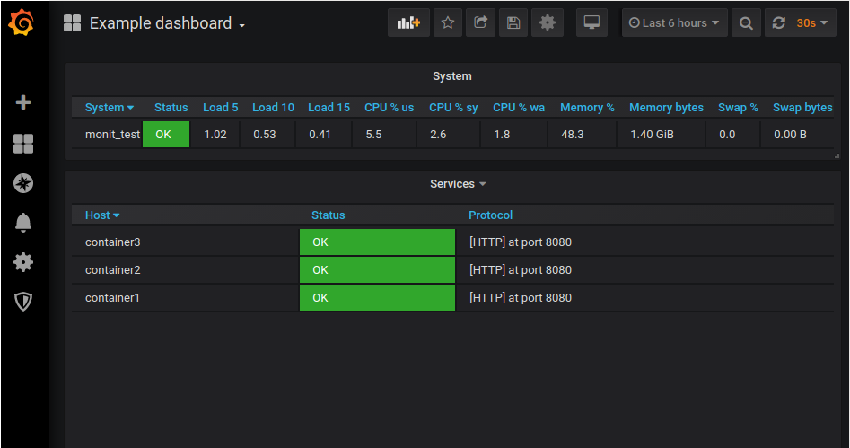

# monit-grafana-example

Example of running monit-grafana instance for checking containerized services in docker-compose.

Docker-compose file contains: 
* 3 mock containers, listening on port 8080 and serving response for '/status' request
* monit container (built from https://github.com/demetrio108/monit) with simple remote checks configuration
* monit-grafana container (built from https://github.com/demetrio108/monit-grafana) for exporting monit dashboard to Grafana
* Grafana itself

## Quick start

Clone this repo and cd inside:
```
git clone https://github.com/demetrio108/monit-grafana-example && cd monit-grafana-example
```
Launch deployment:
```
docker-compose up
``` 
Install SimpleJSON plugin from another terminal window (This was for old Grafana v7):
```
docker exec -ti grafana grafana-cli plugins install grafana-simple-json-datasource
```
Restart Grafana:
```
docker restart grafana
```
Login to Grafana (http://localhost:3000 admin/admin) and create new datasource with type SimpleJSON. For new Grafana v12 it's simpod-json.
Use URL http://monit-grafana:8080/monit_test/ and leave default values for other parameters.

Select Dashboards->Manage from menu, then click Upload button and choose sample provided dashboard 
`monit-grafana-dashboard.json`. On successfull import you should see dashboard like this:

 

Try stopping/starting containers
```
docker stop container1
docker start container1
```
